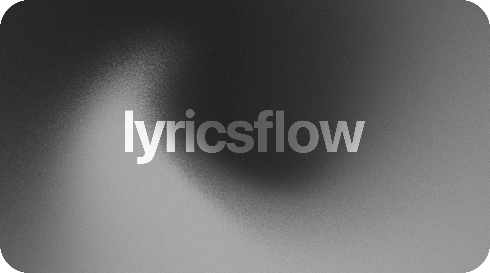

**A web-based music player with synced lyrics, dynamic backgrounds, and that glassmorphism look you've been seeing everywhere.**

---

## What is this?

Lyricsflow started as a love letter to Apple Music's lyric experience — you know, the one where the words light up syllable by syllable and the background pulses with the album art. I wanted that on the web, so here we are.

## What can it do?

**Looks**
- Semi-transparent glassmorphism UI that shifts colors based on whatever album art is playing
- Dynamic backgrounds pulled straight from the artwork in real time
- Animated video cover art (Apple Music style, if that's your thing)

**Lyrics**
- Word-by-word sync with glow and scale effects — the words literally pop as they're sung
- TTML syllable lyrics and classic LRC files both work
- A simpler animation mode if the full effect feels like too much

**Under the hood**
- Multiple lyric providers you can swap between on the fly — Lyricsflow API, Apple Music, Musixmatch, LRCLIB, and Netease
- Handles ID3 and FLAC tags so your track info comes through clean
- Gibberish and Weeb display modes exist because why not

## Getting started

No install, no build step — it just runs in your browser.

1.  Go to [spicyamll.online](https://spicyamll.online)
2.  Drop your audio files (MP3, FLAC, whatever) and optionally a `.ttml` lyrics file, or just search the Apple Music catalog
3.  It figures out the rest — metadata, sync, backgrounds, all of it

## Credits

-   [Spicy Lyrics](https://github.com/Spikerko/spicy-lyrics) — parts of this project are built on and incorporate Spicy Lyrics
-   Everyone who's contributed, tested, or just used the thing
-   San Francisco Pro Fonts from [Apple Developer Fonts](https://developer.apple.com/fonts/) (all rights to Apple Inc.)

## License

Licensed under the GNU Affero General Public License v3.0. Full terms in [LICENSE](LICENSE).
